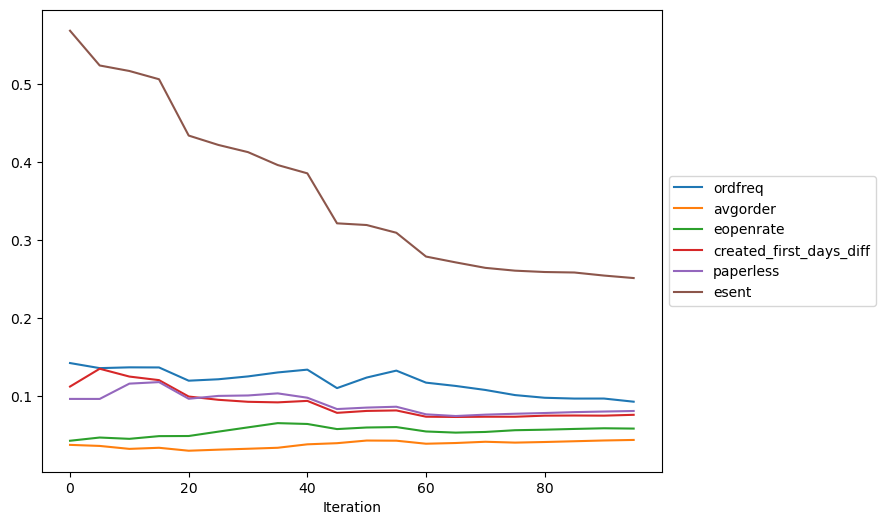
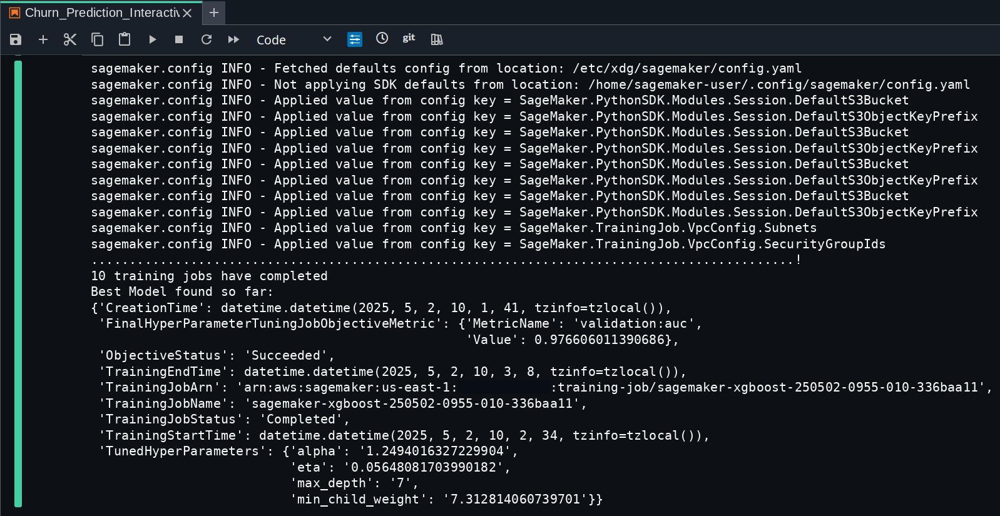
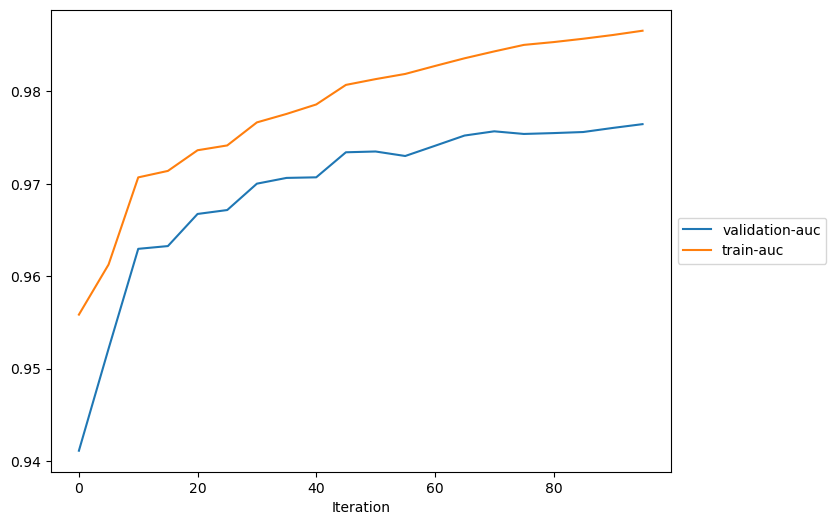
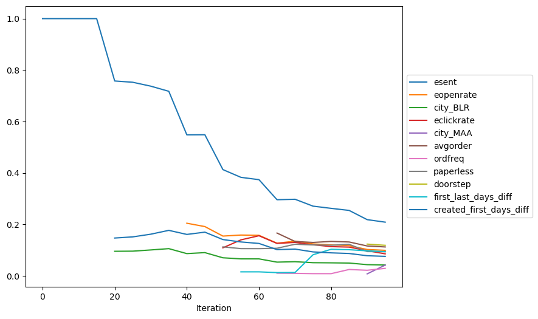
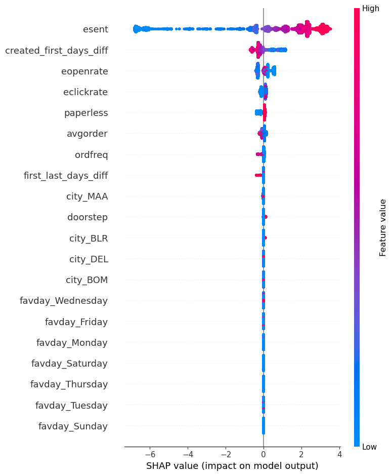
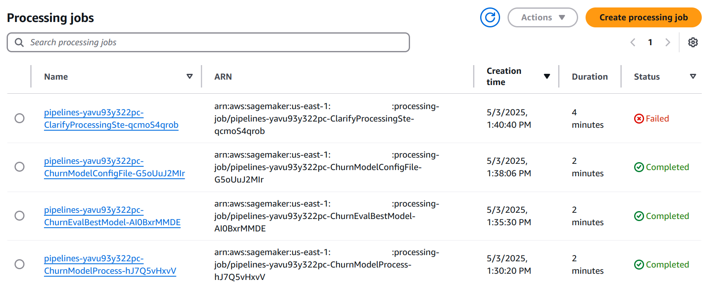

# Churn Prediction with SageMaker Pipelines

Project created by Jeffrey Dick in May 2025.

There are two sources for this project:

- The AWS blog post [Build, tune, and deploy an end-to-end churn prediction model using Amazon SageMaker Pipelines](https://aws.amazon.com/blogs/machine-learning/build-tune-and-deploy-an-end-to-end-churn-prediction-model-using-amazon-sagemaker-pipelines/).
- The AWS sample code in [this GitHub repository](https://github.com/aws-samples/customer-churn-sagemaker-pipelines-sample)

While creating this project I identified and solved SageMaker errors that were not obvious from the blog post or sample code.
Dealing with two main issues upfront can save you some time:

- If you don't have it already, request a quota increase from AWS for `ml.m4.xlarge` for at least 2 instances
	- This can take more than 48 hours to get approved
- Creating the project in SageMaker studio does not provide enough permissions by default
    - Get the correct permissions by attaching the `AmazonS3FullAccess` and `AmazonSageMakerFullAccess` policies to the SageMaker execution role (i.e., the project role ARN that appears after creating the project in SageMaker Studio)

## Introduction

- Predicting whether a customer stops paying (or churns) is an important ability for businesses
- The analytics workflow involves data preparation, experimenting with baseline models, hyperparameter optimization, and model registration
- *Amazon SageMaker* is designed to provide all ML development steps: build, train, and deploy models
- *SageMaker Pipelines* automates model building and support CI/CD
- *SageMaker Clarify* pinpoints biases and generates explanations that are useful for stakeholders

## Aims of this project

- Put together these technologies to implement an end-to-end churn prediction model
- Use current Python libraries and SageMaker features
    - Some changes are needed with respect to the blog post from 2021

## File organization

- `Churn_Prediction_Interactive.ipynb`: Interactive data preprocessing, loading data splits into S3, and hyperparameter optimization
- `Churn_Prediction_Pipeline.ipynb`: Orchestrates all model steps using SageMaker pipeline

## Data preparation

- Download the data from [Customer Retention Retail](https://www.kaggle.com/datasets/uttamp/store-data) on Kaggle
- The unzipped file name is `storedata_total.xlsx`
- Use a spreadsheet program to convert the file to CSV format
- Create an S3 bucket named `churn-prediction-sagemaker-demo`
- In the bucket, create a directory named `data`
- Upload `storedata_total.csv` to the `data` directory of the bucket

## Identity-based policy for S3 bucket access

- After creating the S3 bucket, we need to grant access to an IAM user in the same account
- Instead of a resource-based policy attached to the bucket (I tried this without success), use an identity-based policy
- Find the "Project role ARN" in the project overview, or use this code to get it (see [execution role for the SageMaker notebook instance](https://docs.aws.amazon.com/sagemaker/latest/dg/automatic-model-tuning-ex-role.html)):

```python
from sagemaker import get_execution_role

role = get_execution_role()
print(role)
```

- This ARN has the text "role/datazone_usr_role"
- In the AWS Console, go to IAM > Roles and attach the `AmazonS3FullAccess` policy for this ARN

## Overview of interactive notebook

This section describes steps in `Churn_Prediction_Interactive.ipynb`.

### Step 1: Data preprocessing

- The [sample notebook](https://github.com/aws-samples/customer-churn-sagemaker-pipelines-sample) uses `s3://` URI notation for reading/writing CSV files in S3 buckets
- This is a [Pandas feature](https://pandas.pydata.org/pandas-docs/stable/user_guide/io.html#reading-writing-remote-files) that depends on [s3fs](https://github.com/fsspec/s3fs)
- However, s3fs is not an official AWS product, and there are [issues with using it in SageMaker notebooks](https://repost.aws/questions/QUqm1CyclTQzinmwXZ6OiFLw/installing-s3fs-causes-errors-in-jupyterlab-on-sagemaker)
- Here we access data stored in S3 buckets using Boto3, an SDK for AWS: [API documentation](https://boto3.amazonaws.com/v1/documentation/api/latest/index.html)
- The result is stored in the `storedata` object for further processing
- *NOTE*: The raw data has 30801 rows, while the processed data has 9307 rows

### Step 2: Data loading

- This code splits the data and loads the splits to the S3 bucket
- Writing a Pandas DataFrame to a CSV file in the bucket uses a `StringIO` object to create a buffer as described in this StackOverflow post: [Save Dataframe to csv directly to s3 Python](https://stackoverflow.com/questions/38154040/save-dataframe-to-csv-directly-to-s3-python)

### Step 3: Hyperparameter optimization

I encounted various errors with SageMaker before getting this step to work.

#### Quota for training job usage

> ResourceLimitExceeded: An error occurred (ResourceLimitExceeded) when calling the CreateHyperParameterTuningJob operation: The account-level service limit 'ml.m4.xlarge for training job usage' is 0 Instances, with current utilization of 0 Instances and a request delta of 2 Instances. Please use AWS Service Quotas to request an increase for this quota. If AWS Service Quotas is not available, contact AWS support to request an increase for this quota                                                      

- Request a quota increase in the AWS Console (see [these instructions](https://repost.aws/knowledge-center/sagemaker-resource-limit-exceeded-error))
- A support case was opened and I was granted the quota increase after supplying my use case.

#### S3 bucket permissions

```
UnexpectedStatusException: Error for HyperParameterTuning job sagemaker-xgboost-250502-0415: Failed. Reason: No training job succeeded after 5 attempts. For additional details, please take a look at the training job failures by listing training jobs for the hyperparameter tuning job.
```

- See this page: [Manage Hyperparameter Tuning and Training Jobs](https://docs.aws.amazon.com/sagemaker/latest/dg/multiple-algorithm-hpo-manage-tuning-jobs.html)
- In AWS console, go to Amazon SageMaker AI - Training - Hyperparameter tuning jobs
- Select one of the failed training jobs
- The failure reason was a ClientError (no identity-based policy allows the s3:ListBucket action) which was my clue to use an identify-based policy for S3 bucket access rather than a resource-based policy.

#### Correct format for CSV

After working out the S3 permissions, the hyperparameter tuning failed with a different training job error:

```
AlgorithmError: framework error: Traceback (most recent call last): File "/miniconda3/lib/python3.6/site-packages/sagemaker_xgboost_container/algorithm_mode/train.py", line 196, in train_job verbose_eval=False) File "/miniconda3/lib/python3.6/site-packages/xgboost/training.py", line 216, in train xgb_model=xgb_model, callbacks=callbacks) File "/miniconda3/lib/python3.6/site-packages/xgboost/training.py", line 74, in _train_internal bst.update(dtrain, i, obj) File "/miniconda3/lib/python3.6/site-packages/xgboost/core.py", line 1109, in update dtrain.handle)) File "/miniconda3/lib/python3.6/site-packages/xgboost/core.py", line 176, in _check_call raise XGBoostError(py_str(_LIB.XGBGetLastError())) xgboost.core.XGBoostError: [09:19:22] /workspace/src/objective/regression_obj.cu:101: label must be in [0,1] for logistic regression Stack trace: [bt] (0) /miniconda3/xgboost/libxgboost.so(dmlc::LogMessageFatal::~LogMessageFatal()+0x24) [0x7fdc3719ccb4] [bt] (1) /miniconda3/xgboost/li
```

- The message indicates that the label (first column of the CSV file) is not in [0,1]
- This was fixed by adding `header=False, index=False` in the `.to_csv()` method
- These arguments existed in the original notebook, but I forgot to copy them over 

#### Integer setting for one-hot encoding

After doing the hyperparameter tuning and model fit with SageMaker Debugger (see below), there were still some unexpected results.

- The SHAP plot showed only gray areas for each variable rather than red-blue colors
- The feature importance plot was missing categorical variables processed with one-hot encoding, as shown below (variables like `city_BLR` and `city_MLR` that are created by one-hot encoding are missing)



- Thankfully, there is an easy fix for this in a [PR for the sample code](https://github.com/aws-samples/customer-churn-sagemaker-pipelines-sample/pull/4)
- Just add `dtype=int` to the `pd.get_dummies` call of the **Data processing** section of the notebook to use 1/0 rather than FALSE/TRUE in the one-hot encoding.
- I have made this change to the notebook in this repository

---

- After making those fixes, running the hyperparameter tuning takes **8 minutes**
- Let's celebrate this successful SageMaker setup with a screenshot of the hyperparameter tuning results!



### Step 4: Fit best model with SageMaker Debugger

- This fits the best model and attaches a SageMaker Debugger hook to configure SHAP for feature explainability
- It took **2 minutes** to run

### Step 5: Analyze Debugger output

- Here we analyze debugger output with some visualizations
- Two packages are required that are not available by default in SageMaker: [SMdebug](https://github.com/awslabs/sagemaker-debugger) and [SHAP](https://github.com/shap/shap)
- The notebook contains `!pip install` commands for these packages

#### AUC for training and validation sets



#### Feature importance

- Here I had to revise the `plot_collection()` function because it was only plotting one feature (`esent`) for feature importance
- The revised function uses the `trial.tensor_names()` method instead of `trial.collection()` and is named `plot_collection_all_features()`
- The plot shows that features other than `esent` have no importance value until later in the model fitting



#### SHAP



## Overview of pipeline notebook

This section describes steps in `Churn_Prediction_Pipeline.ipynb`.
Follow these additional data preparation steps before running the notebook:

- Upload `pipeline.py` to the Jupyter Notebook instance (it should be at `/src/pipeline.py`)
- Create a `data` directory in the Jupyter Notebook instance (it should be at `/src/data`)
- Create an `input/code` directory in the S3 bucket (the S3 URI is `s3://churn-prediction-sagemaker-demo/input/code/`)
- Upload these Python scripts to `input/code` in the S3 bucket:
  - `preprocess.py`, `evaluate.py`, `generate_config.py`

#### Step 1: Import packages and declare constants

- Replace the `bucket` value with the S3 bucket created previously

#### Step 2: Generate baseline dataset

- Baseline data will be used to generate SHAP values in the SageMaker Clarify step
- *NOTE*: The sampling fraction defined here (`frac = 0.0002`) results in a file with only two rows

### Step 3: Generate batch dataset

- This generates the batch dataset used for inference in the pipeline

### Step 4: Copy data to S3 bucket

- This copies the files generated above to appropriate locations in the S3 bucket

#### Step 5: Get the pipeline instance

- This instantiates the pipeline usingi code in `pipeline.py`

#### Step 6: Submit the pipeline to SageMaker and start execution

- This submits the pipeline and starts it
- Monitor progress in the AWS Console at Amazon SageMaker AI > Processing jobs
- On my first run, I got an error in `ClarifyProcessingStep` visible in this screenshot:



- Run `execution.list_steps()` in the SageMaker notebook to get more information about the error:

```
'FailureReason': 'ClientError: ClientError: An error occurred (AccessDeniedException) when calling the CreateEndpointConfig operation: User: arn:aws:sts::000000000000:assumed-role/datazone_usr_role_... is not authorized to perform: sagemaker:AddTags on resource: arn:aws:sagemaker:us-east-1:000000000000:endpoint-config/sm-clarify-config-1746251067-14e5 because no identity-based policy allows the sagemaker:AddTags action, exit code: 1',
```

- Solution: Add the `AmazonSageMakerFullAccess` policy to the SageMaker execution role
